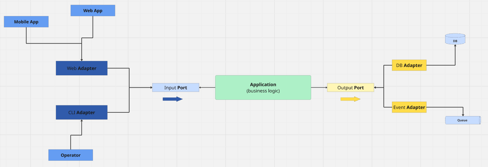

## **Schéma de l'Architecture Hexagonale : Cœur Métier, Ports et Adaptateurs**

 

L'architecture hexagonale repose sur trois piliers :
1. **Cœur métier** : Logique applicative pure (ex : calcul de commissions).
2. **Ports** : Interfaces définissant les entrées/sorties (ex : `IPToCountryConverter`).
3. **Adaptateurs** : Implémentations techniques (ex : API REST, base de données).

